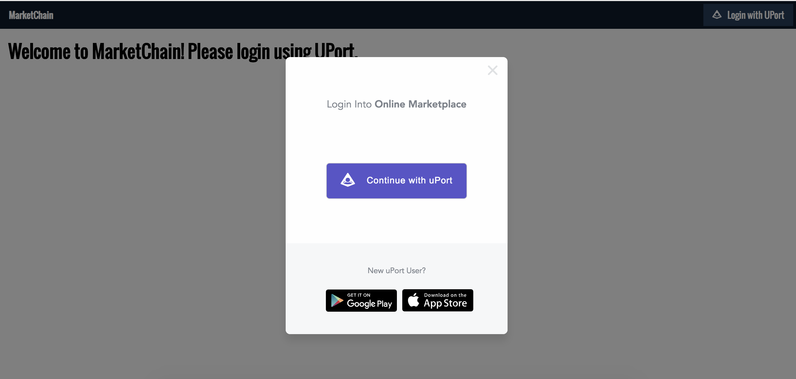
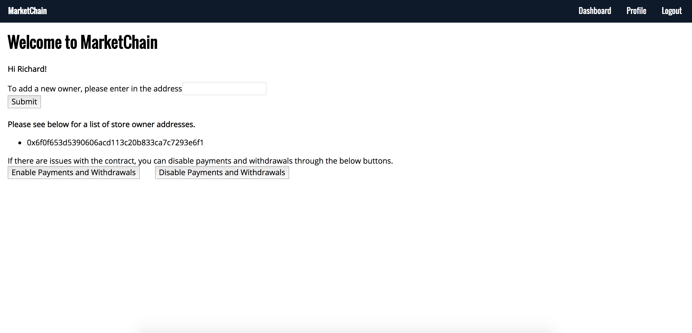

# OnlineMarketplace

## Overview

The purpose of this project is to create an online marketplace that operates on the blockchain. The app uses UPort for open identity management



as well as IPFS for storing images.

There are three types of accounts: admin, store owners, and customers. In order to switch between accounts, please select a different account in Metamask and refresh the page.

**Admins**

The admin for the contract is the first account in metamask (Account 1). Admins have the ability to add store owners to the website as well as activate/ deactive the circuit breaker, preventing purchases and withdrawals in case there is a bug.



**Store Owners**

The store owners have the ability to create a store and add products to their stores. They also have the ability to remove the products, change the price of the products and withdraw funds from the stores.


**Customers**

Customers can browse through the different stores


and purchase any products that they want.


## Usage

To run the app locally, first make sure ganache-cli and truffle are installed globally by running: 

```npm i -g truffle ganache-cli```

Also make sure to download the node modules.

``` npm i ```

To run ganache on the command line: 

```ganache-cli -l 20000000000```

The -l flag sets the gas limit. This is necessary because some of the contract functions exceed the default gas limit. 

Before starting the app, make sure that the ethereum contracts are deployed to the ganache environment:

```truffle migrate```

The development webserver runs on port 3000 and is started with:

```npm start```

Finally, make sure to login to metamask with the provided seed from ganache-cli. Remember to reset the account in order to prevent nonce mismatch errors.

**Please note that for some of the contract functions (deleting products and withdrawing funds), metamask incorrectly estimates the amount of gas needed to run it and will therefore return an 'out of gas' error. In instances like these, hit the edit button in metamask and raise the gas limit.**

This webapp uses the UPort library to login, so please download the UPort app on your phone.

When adding images (i.e. for store fronts and products), it may take awhile for the Metamask prompt to show up. Please be patient.

## Testing the App

To test the smart contracts, with a running ganache instance, run:

```truffle test```
